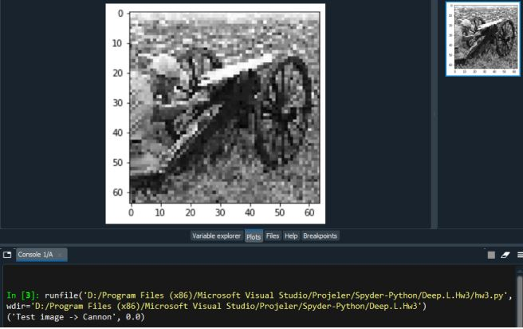
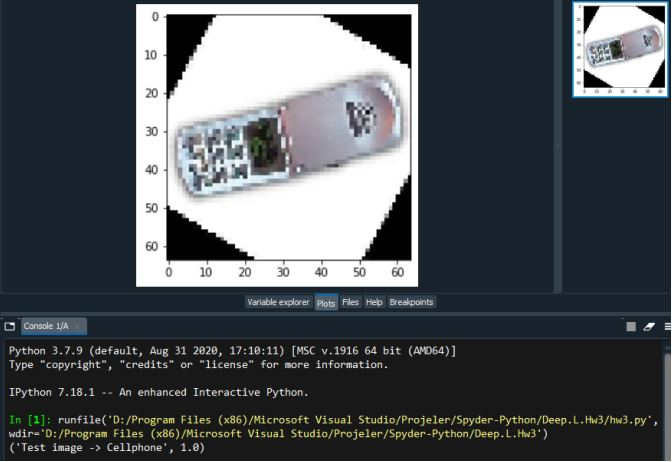

## Perceptron Algorithm to Linear Classifier

Linear classifier between cellphone photos and cannon photos using perceptron algorithm.

Perceptron algoritması kullanarak cep telefonu fotoğrafları ve top fotoğrafları arasında doğrusal sınıflandırıcı.

  

  

Perceptron algoritm creates weights between 0-1. If given test photo has below 0.5 weight,  it should be cannon photo. If it is above 0.5 weight, out will be cellphone photo.

Perceptron algoritması 0-1 arasında ağırlıklar oluşturur. Verilen test fotoğrafı 0,5'in altında ise top fotoğrafı olmalıdır. 0,5 kilonun üzerinde ise cep telefonu fotoğrafı çıkacaktır.
